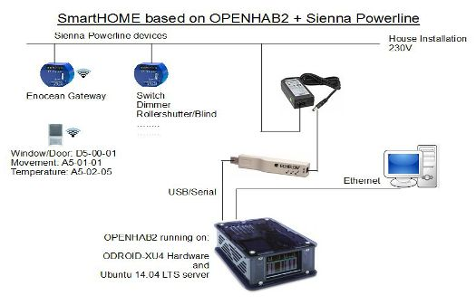
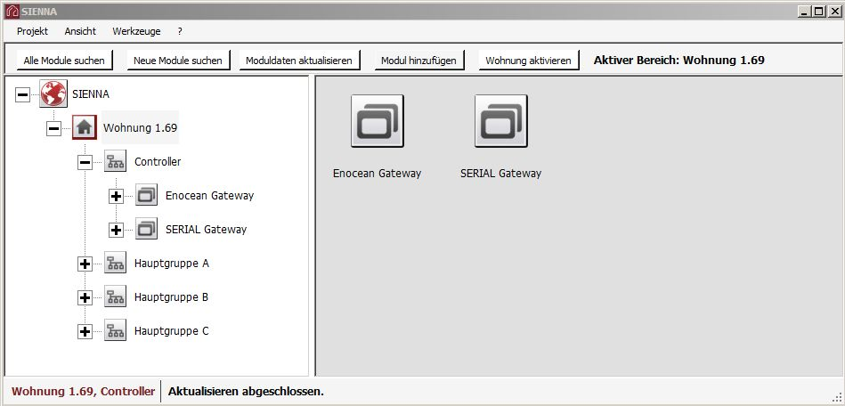
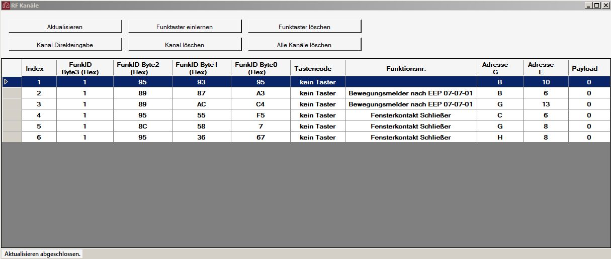
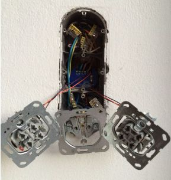
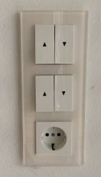
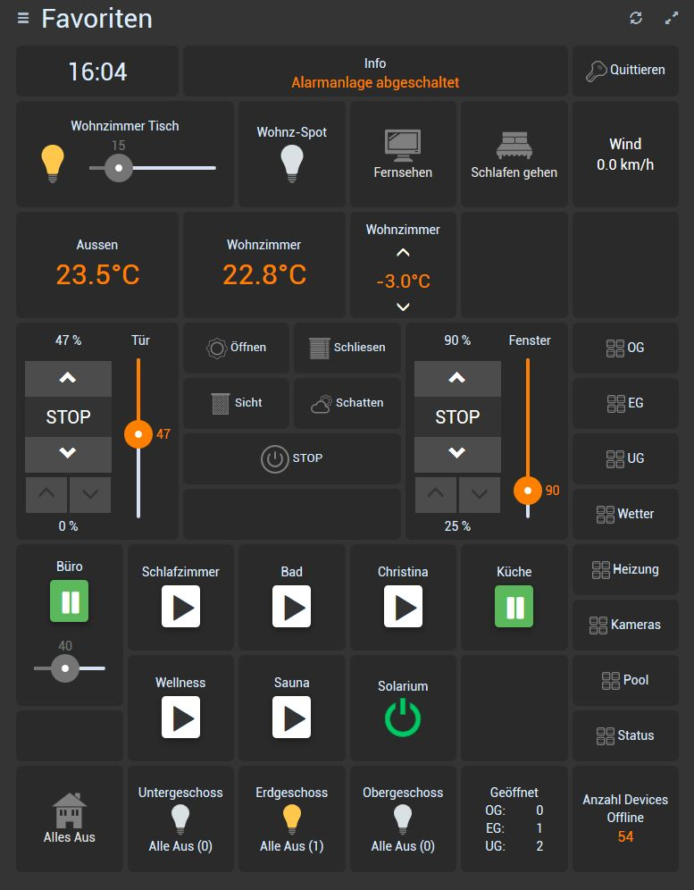
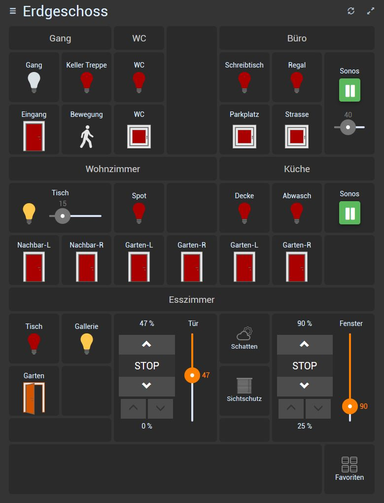
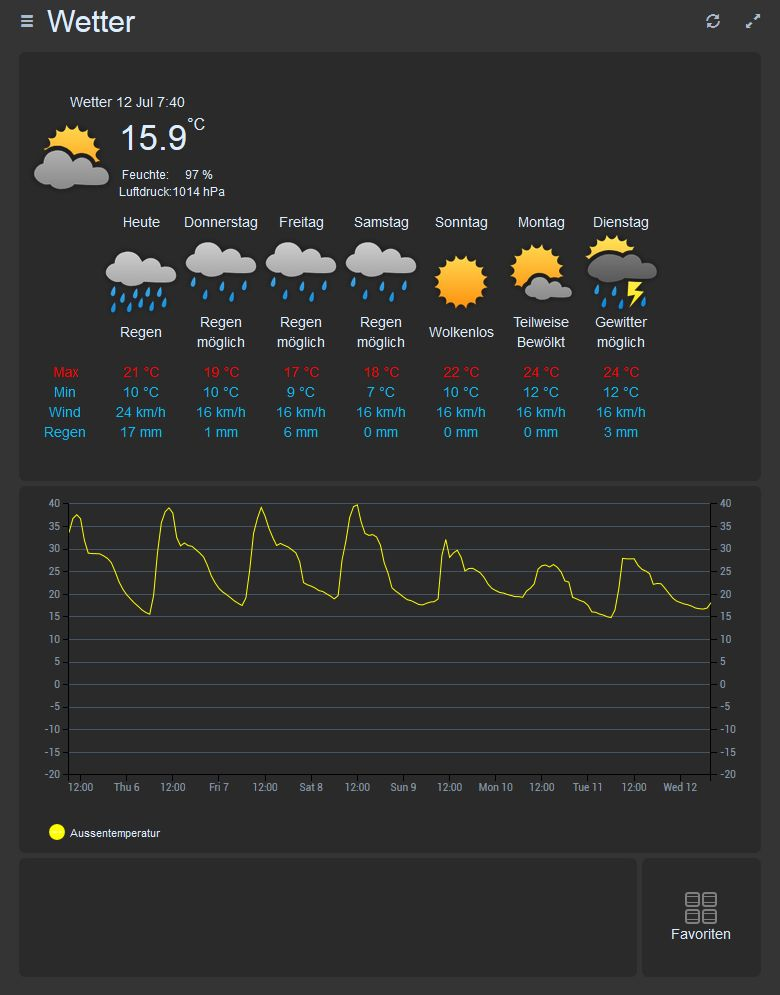

## Changelog
    
    
    v0.8
    * Added SM4 and SM8 devices
    * !!! The channel names for input1 and outlet1 has changed to input2 and outlet2.
    If you have 2 channel devices in use, you have to change your items-file
    
## General

By use of this binding you can operate your "sienna powerline" devices with openhab2 server ([http://www.openhab.org/](http://www.openhab.org/)). With the Sienna Enocean gateway (RFGS) it is possible to connect Enocean sensors over powerline to the openhab2 server.

Informations about the available sensors/actors and their functions can be found [http://www.sienna-system.de/download/](http://www.sienna-system.de/download/) at the end of the page.
 
In combination with openhab2, devices like SAM1L should be set to Push-Switch(position=0) (see sienna documentation).

If there is no communication possible, or existing communication is lost to a device, the item state is set to "UNDEF".

User interface: Tested with the Basic-UI, HABpanel.

 
## I) Prepare Sienna Devices

Configure your Sienna devices with the "Sienna configuration software". Write down neuron-Id, group and element address of each device.

Connect your RS232/USB gateway to the computer where you installed openhab2 server.
Write down the COM-Port the gateway is connected to (e.g: Windows: „COM10“, Linux: "/dev/ttyUSB0"

## II) Install Binding

Go to [https://github.com/s-simma/openhab2-siennaPL/tree/master/addons](https://github.com/s-simma/openhab2-siennaPL/tree/master/addons)

download the zip-file

copy **org.openhab.binding.siennapl-2.1.0-SNAPSHOT.jar** (from the target folder) and **com.neuronrobotics.nrjavaserial_3.12.0.OH.jar** (from the lib folder) into your openhab2 installation **addon** folder.

For now the following Sienna Powerline devices with the latest harware/software versions are supported by the binding:

<table>
<tr><th>Device</th><th>Description</th><th>Channels</th></tr>
<tr><td>SAM1L</td><td>230V input, 230V outputs</td><td>input(OPEN,CLOSED), outlet(ON/OFF), sendCommands:outlet(ON,OFF)</td></tr>
<tr><td>SAM1LT</td><td>230V input, 230V outputs with timer</td><td>input(OPEN,CLOSED), outlet(ON/OFF), sendCommands:outlet(ON,OFF)</td></tr>
<tr><td>AM1</td><td>1 output</td><td>outlet(ON/OFF) sendCommands:outlet (ON,OFF)</td></tr>
<tr><td>SAM2L</td><td>2x230V input, 2x230V outputs</td><td>input, input2(OPEN,CLOSED), outlet, outlet2(ON/OFF) (element e+1 must not be  used in this group), sendCommands:outlet,outlet2(ON,OFF), </td></tr>
<tr><td>AM2X</td><td>2x pot. free outputs</td><td>outlet, outlet2(ON/OFF) (element e+1 must not be used in this group), sendCommands:outlet, outlet2(ON,OFF)</td></tr>
<tr><td>AM2L</td><td>2x 230V outputs</td><td>outlet, outlet2(ON/OFF) (element e+1 must not be used in this group), sendCommands:outlet, outlet2(ON,OFF)</td></tr>
<tr><td>SAMDR</td><td>Dimmer leading-edge</td><td>input(OPEN,CLOSED), outlet(ON/OFF), value(0-100), sendCommands:outlet(ON,OFF), value(0-100)</td></tr>
<tr><td>SAMDU</td><td>Dimmer universal</td><td>input(OPEN,CLOSED), outlet(ON/OFF), value(0-100), sendCommands:outlet(ON,OFF), value(0-100)</td></tr>
<tr><td>SAM2</td><td>Rollershutter / Blind</td><td>input_up,,input_down(OPEN,CLOSED), outlet_up, outlet_down(ON/OFF), position(UP,DOWN,0-100), info(GO_UP,GO_DOWN,UP,DOWN), angle(act. angle of the blades) sendCommands:outlet_up, outlet_down(ON,OFF), position(UP,DOWN,STOP,0-100), angle(+/- 0-100);
Angle channel: set "autoupdate=false"</td></tr>
<tr><td>SM2</td><td>2x pot. free inputs</td><td>input, input2(OPEN,CLOSED) The element Id's for the 2 inputs must be in the same group and the element Id's must be ongoing in ascending order. In the "things-file" enter the SM2 only once (with the first element-Id)</td></tr>
<tr><td>SM4</td><td>4x pot. free inputs</td><td>input, input2, input3, input4(OPEN,CLOSED). The element Id's for the 4 inputs must be in the same group and the element Id's must be ongoing in ascending order. In the "things-file" enter the SM4 only once (with the first element-Id)</td></tr>
<tr><td>SM8</td><td>8x pot. free inputs</td><td>input, input2, input3 ... input8(OPEN,CLOSED). The element Id's for the 8 inputs must be in the same group and the element Id's must be ongoing in ascending order. In the "things-file" enter the SM8 only once (with the first element-Id)</td></tr>
<tr><td>RFGS-CONTACT</td><td>Enocean Contact EEP: D5-00-01</td><td>state(OPEN,CLOSED)</td></tr>
<tr><td>RFGS-MOTION</td><td>Enocean Motion EEP: A5-07-01</td><td>state(OPEN,CLOSED)</td></tr>
<tr><td>RFGS-TEMP</td><td>Enocean Temperature EEP: A5-02-05</td><td>temperature(Number)</td></tr>
</table>

## III) Create things configuration

Example:

**Sienna Gateway:** serialPort="/dev/ttyUSB0", Neuron-Id="0503E1D2E200"

**Rollershutter/Blind:** Neuron-Id="05025FC50E00", Group=B, Element=1

**Dimmer for Light:** Neuron-Id="05024ED65200", Group=A, Element=1

**Switch:** Neuron-Id="0502601CF600", Group=A, Element=2

**Window Contact:** Neuron-Id="0503E8AA7F00", Group=G, Element=1, enoceanEEP="D5-00-01"

**Add following to the …/conf/things/demo.things**

Bridge siennapl:BRIDGE:1 [ serialPort="/dev/ttyUSB0", baud=9600,  neuronId="0503E1D2E200", pollingInterval=60 ] {

    SAM2 B-1 [neuronId="05025FC50E00", groupId="B", elementId=1, spinTime=1200]
    SAMDR A-1 [neuronId="05024ED65200", groupId="A", elementId=1]
    SAM1L A-2 [neuronId="0502601CF600", groupId="A", elementId=2]
    RFGS-CONTACT C-12 [neuronId="0503E8AA7F00", groupId="C", elementId=12, enoceanEEP="D5-00-01"]
}

**For bridge**

**serialPort:**The serial port your RS232/USB gateway is connected to („COM10“, "/dev/ttyUSB0")

**baud:** must be 9600 (the only one that is supported by the gateway)

**neuronId:** the Neuron-Id of the Sienna RS232/USB gateway

**pollingIntervall (minutes):** This is the interval for checking if devices are still connected. The minimum time is 60 minutes. 0 means no monitoring.
For ENOCEAN sensors: If sensor does not send its state during this time, the item state is set to "UNDEF".
For sienna powerline sensor/actors: If there is no data transfer within this time, the monitoring task sends "require status" to the device. That means the states for sienna powerline devices will be set to "UNDEF" latest after 2 cycles.

**For things**

**neuronId:** the Neuron-Id of the Sienna device

**groupId:** The configured Group-Id ("A" to "O")

**elementId:** The configured Element-Id (1 to 15)

**spinTime:** is the time in ms(1/1000 seconds) the blades need to close/open (must be set to 0 for rollershutter)

**enoceanEEP:** ENOCEAN equipment profile. Only the following are supported ("D5-00-01" for contact sensors, "A5-02-05" for Temperature sensors and "A5-07-01" for motion sensors)  

## IV) Create item configuration

**Add following to the …/conf/items/demo.items**

**Rollerschutter/Blind Control item**

Rollershutter MyShutter "My Shutter [%d %%]" <rollershutter> (gShutte) {channel="siennapl:SAM2:1:B-1:position", autoupdate="true"}

**Rollershutter/blind Dimmer item: to move to a predefined position**

Dimmer MyShutter_Pos "My Shutter" <rollershutter> (gShutter) {channel="siennapl:SAM2:1:B-1:position", autoupdate="true"}

**Rollershutter/Blind Number item: to move the blades (in +/- percent)**

Number JalousieEZT_Angle {channel="siennapl:SAM2:1:B-1:angle", autoupdate="false"}

**Dimmer item for lights**

Switch MyDimmedLight_S "My Dimmed Light" <light> (gLight) {channel="siennapl:SAMDR:1:A-1:outlet", autoupdate="false"}

Dimmer MyDimmedLight_D " My Dimmed Light [%d %%]" <slider> (gLight) {channel="siennapl:SAMDR:1:A-1:value", autoupdate="true"}           			

**Switch item**

Switch MySwitch "My Switch" <light> (gLight) {channel="siennapl:SAM1L:1:A-2:outlet", autoupdate="false"}

**Enoecean Contact item**

Contact MyContact "My Contact [%s]" <window> (gContact) {channel="siennapl:RFGS-CONTACT:1:C-12:state"}

## V) Online / Offline state

On startup the device/thing states are "OFFLINE" and the item states are "NULL". During startup the binding is trying to get the actual status from all configured device. Devices which respond are set to "ONLINE" and its item states to the actual values. All other devices/things stay "OFFLINE" and its item states stay "NULL".
After the polling period expires the binding is checking the actual states of the devices. The one which do not answer will be set to "OFFLINE" and its items states to "UNDEF". The one which answer will be set to "ONLINE" and its item states to the actual value.

What does this mean:
If for e.g. the power is removed from a module, after the polling time the thing state will go to "OFFLINE" and the item states will go to "UNDEF". **During module/thing is "OFFLINE" no commands will be sent to this device.** If the power is back again, it could take (in the worst case) the polling time to bring this device/thing back to "ONLINE".

What can be done to immediately get a reconnected device "ONLINE ?
 
1. Push a local button on the Sienna module (Only possible if there is one)
2. Search for Sienna devices in Paper-UI
3. Restart your server
4. Wait for the polling period to expire

## VI) Pictures

Overview of the system

Sienna professional configuration software

Sienna professional configuration software (ENOCEAN devices)

Install the Sienna devices behind your switches

At the end it looks same as before. BUT: you can control it from remote

If you use the fantastic HABpanel-UI you can operate it from your PC/tablet/mobile
([https://community.openhab.org/c/apps-services/habpanel](https://community.openhab.org/c/apps-services/habpanel))

The only problem is, if you want to display 3 states of a device e.g. (ON/OFF/UNDEF(NULL), you have to create custom widgets. In the following deshboards i have 4 custom widgets in use:

If you want your deshboards look like the examples below you have to do the following:

- [myHabpanel.css](https://github.com/s-simma/openhab2-siennaPL/blob/master/customWidgets/myHabpanel.css) (copy this file into "...\conf\html" folder)
- [icons-classic.zip](https://github.com/s-simma/openhab2-siennaPL/blob/master/customWidgets/icons-classic.zip "Classic Icons") (copy content of zip-file to "...\icons\classic" folder)
- [Si-Contact.widget.json](https://github.com/s-simma/openhab2-siennaPL/blob/master/customWidgets/Si-Contact.widget.json "3-State contact widget"): for 3 state contacts (window/door/motion sensors)
- [Si-Switch.widget.json](https://github.com/s-simma/openhab2-siennaPL/blob/master/customWidgets/Si-Switch.widget.json "3-state switch widget"): for 3 state switches (lights etc.)
- [Si-Dimmer.widget.json](https://github.com/s-simma/openhab2-siennaPL/blob/master/customWidgets/Si-Dimmer.widget.json "3-state dimmer widget"): for 3 state Dimmer
- [Si-Blind.widget.json](https://github.com/s-simma/openhab2-siennaPL/blob/master/customWidgets/Si-Blind.widget.json "Blind Widget"): for rollerschutters/blinds
- [Si-Master-Off.widget.json](https://github.com/s-simma/openhab2-siennaPL/blob/master/customWidgets/Si-Master-Off.widget.json "Master-Off Button for group"): For switch-off lights in a group
- [Weather.txt](https://github.com/s-simma/openhab2-siennaPL/blob/master/customWidgets/weather.txt) (create template -> copy content of weather.txt into template)
- [Weather icons](https://github.com/s-simma/openhab2-siennaPL/blob/master/customWidgets/wunderground.zip) for weather template (entpack content of zip-file in ".../static/images" folder). The condition icons are taken from the "....conf\html\images\wunderground\colorful\myImages" folder. You have to copy the missing one into this folder.

The openhab items for the weather template has to be as folled:

    DateTime ObservationTime "Observation time" {channel="weatherunderground:weather:home:current#observationTime"}
    String Conditions "Condition" {channel="weatherunderground:weather:home:current#conditions"}
    Image Icon "Icon" {channel="weatherunderground:weather:home:current#icon"}
    Number Temperature "Temperature" {channel="weatherunderground:weather:home:current#temperature"}
    Number FeelTemp "Feeling temperature" {channel="weatherunderground:weather:home:current#feelingTemperature"}
    Number Humidity "Humidity" {channel="weatherunderground:weather:home:current#relativeHumidity"}
    Number Pressure "Pressure" {channel="weatherunderground:weather:home:current#pressure"}
    
    DateTime ForecastTime0 "time" {channel="weatherunderground:weather:home:forecastToday#forecastTime"}
    String Forecast0 "Forecast" {channel="weatherunderground:weather:home:forecastToday#conditions"}
    Image Icon0 "Icon" {channel="weatherunderground:weather:home:forecastToday#icon"}
    Number Temp_Min0 "min temp" {channel="weatherunderground:weather:home:forecastToday#minTemperature"}
    Number Temp_Max0 "max temp" {channel="weatherunderground:weather:home:forecastToday#maxTemperature"}
    Number Wind_Speed0 "Max wind speed" {channel="weatherunderground:weather:home:forecastToday#maxWindSpeed"}
    Number Precip_Probability0 "Rain" {channel="weatherunderground:weather:home:forecastToday#precipitationDay"}
    Number snow0 "Snow" {channel="weatherunderground:weather:home:forecastToday#snow"}
    
    DateTime ForecastTime1 "time" {channel="weatherunderground:weather:home:forecastTomorrow#forecastTime"}
    String Forecast1 "Forecast" {channel="weatherunderground:weather:home:forecastTomorrow#conditions"}
    Image Icon1 "Icon" {channel="weatherunderground:weather:home:forecastTomorrow#icon"}
    Number Temp_Min1 "min temp" {channel="weatherunderground:weather:home:forecastTomorrow#minTemperature"}
    Number Temp_Max1 "max temp" {channel="weatherunderground:weather:home:forecastTomorrow#maxTemperature"}
    Number Wind_Speed1 "Max wind speed" {channel="weatherunderground:weather:home:forecastTomorrow#maxWindSpeed"}
    Number Precip_Probability1 "Rain" {channel="weatherunderground:weather:home:forecastTomorrow#precipitationDay"}
    Number snow1 "Snow" {channel="weatherunderground:weather:home:forecastTomorrow#snow"}
    
    DateTime ForecastTime2 "Observation time" {channel="weatherunderground:weather:home:forecastDay2#forecastTime"}
    String Forecast2 "Forecast" {channel="weatherunderground:weather:home:forecastDay2#conditions"}
    Image Icon2 "Icon" {channel="weatherunderground:weather:home:forecastDay2#icon"}
    Number Temp_Min2 "min temp" {channel="weatherunderground:weather:home:forecastDay2#minTemperature"}
    Number Temp_Max2 "max temp" {channel="weatherunderground:weather:home:forecastDay2#maxTemperature"}
    Number Wind_Speed2 "Max wind speed" {channel="weatherunderground:weather:home:forecastDay2#maxWindSpeed"}
    Number Precip_Probability2 "Rain" {channel="weatherunderground:weather:home:forecastDay2#precipitationDay"}
    Number snow2 "Snow" {channel="weatherunderground:weather:home:forecastDay2#snow"}
    
    DateTime ForecastTime3 "Observation time" {channel="weatherunderground:weather:home:forecastDay3#forecastTime"}
    String Forecast3 "Forecast" {channel="weatherunderground:weather:home:forecastDay3#conditions"}
    Image Icon3 "Icon" {channel="weatherunderground:weather:home:forecastDay3#icon"}
    Number Temp_Min3 "min temp" {channel="weatherunderground:weather:home:forecastDay3#minTemperature"}
    Number Temp_Max3 "max temp" {channel="weatherunderground:weather:home:forecastDay3#maxTemperature"}
    Number Wind_Speed3 "Max wind speed" {channel="weatherunderground:weather:home:forecastDay3#maxWindSpeed"}
    Number Precip_Probability3 "Rain" {channel="weatherunderground:weather:home:forecastDay3#precipitationDay"}
    Number snow3 "Snow" {channel="weatherunderground:weather:home:forecastDay3#snow"}
    
    DateTime ForecastTime4 "Observation time" {channel="weatherunderground:weather:home:forecastDay4#forecastTime"}
    String Forecast4 "Forecast" {channel="weatherunderground:weather:home:forecastDay4#conditions"}
    Image Icon4 "Icon" {channel="weatherunderground:weather:home:forecastDay4#icon"}
    Number Temp_Min4 "min temp" {channel="weatherunderground:weather:home:forecastDay4#minTemperature"}
    Number Temp_Max4 "max temp" {channel="weatherunderground:weather:home:forecastDay4#maxTemperature"}
    Number Wind_Speed4 "Max wind speed" {channel="weatherunderground:weather:home:forecastDay4#maxWindSpeed"}
    Number Precip_Probability4 "Rain" {channel="weatherunderground:weather:home:forecastDay4#precipitationDay"}
    Number snow4 "Snow" {channel="weatherunderground:weather:home:forecastDay4#snow"}
    
    DateTime ForecastTime5 "Observation time" {channel="weatherunderground:weather:home:forecastDay5#forecastTime"}
    String Forecast5 "Forecast" {channel="weatherunderground:weather:home:forecastDay5#conditions"}
    Image Icon5 "Icon" {channel="weatherunderground:weather:home:forecastDay5#icon"}
    Number Temp_Min5 "min temp" {channel="weatherunderground:weather:home:forecastDay5#minTemperature"}
    Number Temp_Max5 "max temp" {channel="weatherunderground:weather:home:forecastDay5#maxTemperature"}
    Number Wind_Speed5 "Max wind speed" {channel="weatherunderground:weather:home:forecastDay5#maxWindSpeed"}
    Number Precip_Probability5 "Rain" {channel="weatherunderground:weather:home:forecastDay5#precipitationDay"}
    Number snow5 "Snow" {channel="weatherunderground:weather:home:forecastDay5#snow"}
    
    DateTime ForecastTime6 "Observation time" {channel="weatherunderground:weather:home:forecastDay6#forecastTime"}
    String Forecast6 "Forecast" {channel="weatherunderground:weather:home:forecastDay6#conditions"}
    Image Icon6 "Icon" {channel="weatherunderground:weather:home:forecastDay6#icon"}
    Number Temp_Min6 "min temp" {channel="weatherunderground:weather:home:forecastDay6#minTemperature"}
    Number Temp_Max6 "max temp" {channel="weatherunderground:weather:home:forecastDay6#maxTemperature"}
    Number Wind_Speed6 "Max wind speed" {channel="weatherunderground:weather:home:forecastDay6#maxWindSpeed"}
    Number Precip_Probability6 "Rain" {channel="weatherunderground:weather:home:forecastDay6#precipitationDay"}
    Number snow6 "Snow" {channel="weatherunderground:weather:home:forecastDay6#snow"}
        

## Remarks

The first time you start the binding will give you a warning "Serial error". Don't worry about this. This is a small bug in the sienna gateway (first command after power-up is not recogniced -> will be repeated) 

I have never tried to use Paper-UI to configure things/items. To be honest: I don't like it.
But in principle it shoud be possible.

The discovery service will not show the ENOCEAN bridge itself (only the attached devices).
 

## Known issues

If you update the sienna powerline binding (copy a new jar-file into the addon folder) you have to restart your server. There is a known bug in the actual "nrjavaserial" driver which prevents closing a serial port (timeout). I hope this problem will be solved with the new version of the nrjavaserial driver. 

## To Do List

Set max. up/down time for rollershutter/blinds (for now you have to use the Sienna configuration software)
